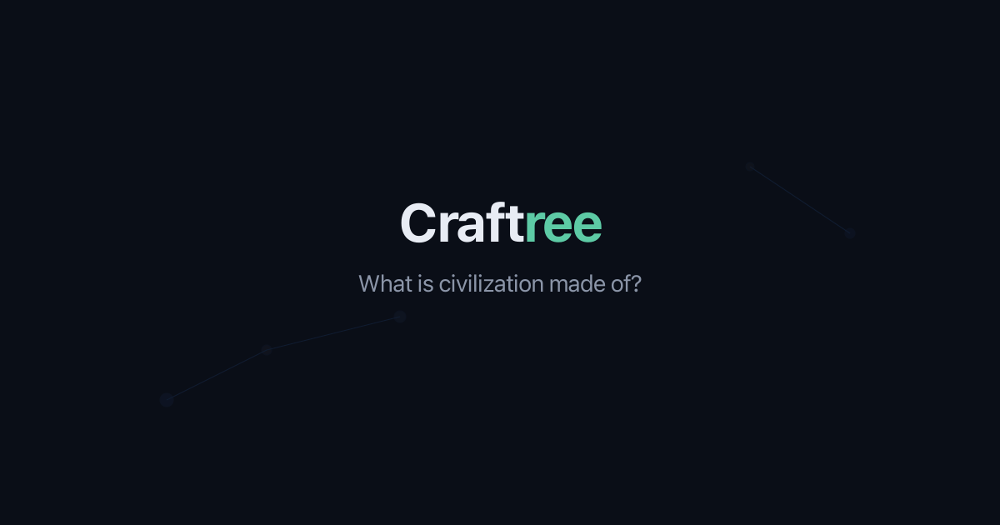

<p align="center">
  
</p>

<h1 align="center">Craftree</h1>

<p align="center">
  <strong>The fabrication tree of human civilization</strong><br/>
  Explore how every technology is made, from raw materials up.
</p>

<p align="center">
  <a href="https://craftree.app">Live Site</a> · 
  <a href="https://craftree.app/about">About</a> · 
  <a href="https://x.com/Craftree_app">Twitter</a>
</p>

---

## What is Craftree?

Craftree is an interactive technology tree that models human inventions as **fabrication recipes**. Unlike classic timelines that show *when* things were invented, Craftree answers a different question: **what do you need to make them?**

Each invention is broken down into three dimensions: the materials it's made of, the processes used to transform them, and the tools and machines required. Click on any input to explore its own recipe, all the way down to raw materials found in nature — sand, clay, wood, water, fire.

The result is an inverted pyramid. At the top, a smartphone. At the bottom, sand and ore. In between, hundreds of inventions stacked on one another, each made possible by those before it. Craftree makes that depth visible and explorable.

The project was born from a conviction: in a world where everything moves faster, it matters to understand where things come from — not only who invented them, but what had to be assembled, transformed, and mastered for them to exist.

<p align="center">
  
</p>

## Features

**Interactive graph** — Pan, zoom, and click through 260+ inventions organized in layers. Raw materials at the bottom, complex products at the top. The vertical axis represents transformation depth: how many fabrication steps from nature.

**Focused view** — Click any invention to see its inputs below and outputs above, with all other nodes faded out. Navigate the fabrication chain click by click.

**5 relation types** — Each link is classified: Material (consumed), Tool (reused), Energy, Knowledge (prerequisite), or Catalyst. Color-coded and visually distinct.

**AI-powered database** — Inventions are classified using Claude (Anthropic) with web search, following a strict 3-question decision tree: type → category → inputs.

**6 languages** — French (default), English, Spanish, Chinese, Hindi, Arabic. Interface and labels are fully translated; invention names fall back to English for non-FR languages.

**Contributor mode** — Registered users can suggest corrections, new inventions, and new links. All suggestions go through a moderation queue before being published.

**Admin panel** — Review, approve, modify, or reject suggestions with a visual diff view. Track contributor activity and manage the database.

**Shareable URLs** — Every invention has its own URL (`/invention/acier`) with Open Graph metadata for rich previews on social media.

## How the graph works

```
Layer 14  ┌─────────────┐
          │  Smartphone  │
          └──────┬───────┘
                 │
Layer 8   ┌──────┴───────┐
          │  Transistor   │
          └──────┬───────┘
                 │
Layer 5   ┌──────┴───────┐
          │   Silicon     │
          └──────┬───────┘
                 │
Layer 1   ┌──────┴───────┐
          │    Sand       │  ← raw material
          └──────────────┘
```

The Y-axis is fixed by `complexity_depth` — the number of transformation steps from nature. The X-axis is optimized by dagre for readability. This hybrid approach preserves semantic meaning vertically while minimizing edge crossings horizontally.

## Classification methodology

Each invention is classified using a 3-question decision tree:

1. **Does it exist in nature without human intervention?** → Raw material. Otherwise, is it a physical object or a technique? Techniques are processes; objects are classified by usage — tools if reusable, components if integrated, end products if used directly.

2. **In which domain is it primarily used?** → One of 20 categories (Electronics, Transport, Food, Chemistry, etc.)

3. **What inputs are needed to make it?** → For each input: is it consumed (material), reused (tool), does it provide energy, or does it represent prerequisite knowledge?

## Tech stack

| Layer | Technology |
|-------|-----------|
| Framework | Next.js 16 (App Router) |
| Graph | React Flow (@xyflow/react) |
| Layout | dagre (layered graph layout) |
| Styling | Tailwind CSS 4 |
| State | Zustand |
| Search | Fuse.js (fuzzy client-side) |
| Database | Supabase (PostgreSQL) |
| Auth | Supabase Auth (Google OAuth) |
| AI enrichment | Anthropic API (Claude + web search) |
| Images | Wikimedia Commons (direct URLs) |
| i18n | next-intl (6 languages) |
| Hosting | Vercel |
| Domain | craftree.app |

## Getting started

### Prerequisites

- Node.js 18+
- npm
- A Supabase project (free tier works)
- Anthropic API key (for the populate script only)

### Installation

```bash
git clone https://github.com/craftreeapp-sudo/craftree.git
cd craftree
npm install
```

### Environment variables

Create a `.env.local` file at the root:

```env
# Supabase
NEXT_PUBLIC_SUPABASE_URL=https://your-project.supabase.co
NEXT_PUBLIC_SUPABASE_ANON_KEY=your-anon-key
SUPABASE_SERVICE_ROLE_KEY=your-service-role-key

# Admin
NEXT_PUBLIC_ADMIN_EMAIL=your-email@gmail.com

# Anthropic (only needed for populate script)
ANTHROPIC_API_KEY=sk-ant-...

# Site
NEXT_PUBLIC_SITE_URL=https://craftree.app
```

### Database setup

1. Create a Supabase project at [supabase.com](https://supabase.com)
2. Go to SQL Editor and run the contents of `supabase/schema.sql`
3. Import seed data: `npm run import:supabase`

### Development

```bash
npm run dev
```

Open [http://localhost:3000](http://localhost:3000).

## Scripts

| Script | Description |
|--------|-------------|
| `npm run dev` | Start development server |
| `npm run build` | Production build |
| `npm run start` | Start production server |
| `npm run lint` | Run ESLint |
| `npm run populate` | Enrich inventions via Claude API (parallel, 5 concurrent) |
| `npm run populate -- --expand` | Re-enrich existing inventions with missing data |
| `npm run populate -- --deep` | Follow dependencies to level 2 |
| `npm run fetch:images` | Fetch Wikimedia image URLs for all inventions |
| `npm run translate` | Translate French descriptions to English via Claude |
| `npm run clean:descriptions` | Remove `<cite>` artifacts from descriptions |
| `npm run import:supabase` | Import seed-data.json into Supabase |
| `npm run generate:og` | Generate Open Graph default image |

## Project structure

```
craftree/
├── src/
│   ├── app/                    # Next.js App Router pages
│   │   ├── page.tsx            # Landing page
│   │   ├── explore/            # Main graph view
│   │   ├── invention/[id]/     # OG metadata + redirect
│   │   ├── about/              # About page
│   │   ├── editor/             # Admin editor
│   │   ├── admin/              # Admin moderation panel
│   │   ├── profile/            # User profile
│   │   └── api/                # API routes (admin actions)
│   ├── components/
│   │   ├── graph/              # TechGraph, TechNodeCard, TechEdge
│   │   ├── ui/                 # Sidebar, SearchBar, Filters, Legend
│   │   └── layout/             # Header, Footer
│   ├── stores/                 # Zustand stores (graph, UI, auth)
│   ├── lib/                    # Supabase client, data fetching, auth
│   ├── messages/               # i18n translation files (fr, en, es, zh, hi, ar)
│   └── data/                   # seed-data.json (backup)
├── scripts/
│   ├── populate.mjs            # AI enrichment script
│   ├── fetch-image-urls.mjs    # Wikimedia image fetcher
│   ├── translate-descriptions.mjs
│   ├── clean-descriptions.mjs
│   ├── import-to-supabase.mjs
│   └── generate-og.mjs
├── supabase/
│   └── schema.sql              # Database schema
└── public/
    ├── og-default.png           # Default OG image
    └── images/                  # Static assets
```

## Data model

```typescript
TechNode {
  id: string              // slug (e.g. "acier")
  name: string             // French name
  name_en: string          // English name
  description: string      // French description
  description_en: string   // English description
  category: NodeCategory   // 20 values (mineral, electronics, food...)
  type: NodeType           // raw_material | process | tool | component | end_product
  era: Era                 // 8 periods (prehistoric → contemporary)
  year_approx: number      // approximate year of invention
  origin: string           // inventor, company, or country
  image_url: string        // Wikimedia Commons URL
  wikipedia_url: string    // Wikipedia page
  complexity_depth: number // computed: steps from raw materials
}

CraftingLink {
  source_id: string        // input invention
  target_id: string        // output invention
  relation_type: string    // material | tool | energy | knowledge | catalyst
  quantity_hint: string    // "beaucoup", "un", "modéré"
  is_optional: boolean
}
```

## Contributing

Craftree is open source. There are two ways to contribute:

**On the site** — Create an account on [craftree.app](https://craftree.app), then use the "Suggest a correction" button or the "+" buttons to propose changes. All suggestions are reviewed before publication.

**On GitHub** — Open an issue for bugs, missing inventions, or classification errors. Pull requests are welcome for code improvements.

### What makes a good contribution

- A missing invention that is fundamental (widely used, historically significant)
- A missing fabrication link between two existing inventions
- A correction to a classification (wrong category, type, or date)
- A better description or translation

### What to avoid

- Overly specialized inventions (e.g., a specific model of a machine rather than the machine itself)
- Inventions that are variants rather than distinct technologies
- Links that represent inspiration rather than fabrication dependency

## Inspiration

Craftree is inspired by the [Historical Tech Tree](https://historicaltechtree.com) by Étienne Fortier-Dubois, the technology trees from the Civilization game series, and the conviction that understanding where things come from is the first step to understanding where they're going.

## Credits

Craftree is an independent project created by **Julien Beljio**. It is not affiliated with any company, university, or institution. The code is open source (MIT) and the data is freely accessible.

If you'd like to support the project, contribute content on the site, share it with others, or reach out via [Contact](https://craftree.app/contact).

Built with Next.js, React Flow, and Tailwind CSS. Data enriched by Claude (Anthropic). Images from Wikimedia Commons.

## License

MIT

---

<p align="center">
  <sub>If you wish to make an apple pie from scratch, you must first invent the universe. — Carl Sagan</sub>
</p>